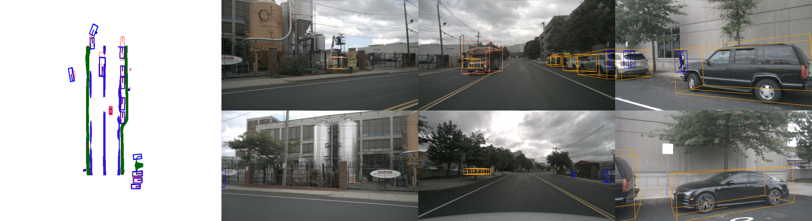
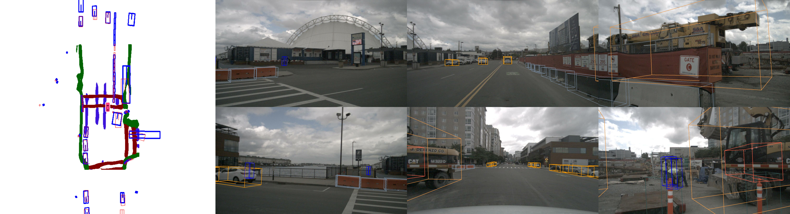

# BEVFormer: a Cutting-edge Baseline for Camera-based Detection
注：本代码库在BEVFormer算法所提供的代码的基础上新增了BEV分割代码

https://user-images.githubusercontent.com/72087870/232678436-b0b51b1b-fe09-4ed1-aadd-be2589360276.mp4

# Abstract
In this work, the authors present a new framework termed BEVFormer, which learns unified BEV representations with spatiotemporal transformers to support multiple autonomous driving perception tasks. In a nutshell, BEVFormer exploits both spatial and temporal information by interacting with spatial and temporal space through predefined grid-shaped BEV queries. To aggregate spatial information, the authors design a spatial cross-attention that each BEV query extracts the spatial features from the regions of interest across camera views. For temporal information, the authors propose a temporal self-attention to recurrently fuse the history BEV information.
The proposed approach achieves the new state-of-the-art **56.9\%** in terms of NDS metric on the nuScenes test set, which is **9.0** points higher than previous best arts and on par with the performance of LiDAR-based baselines.

# Methods

# Getting Started
- [Installation](docs/install.md) 
- [Prepare Dataset](docs/prepare_dataset.md)
- [Run and Eval](docs/getting_started.md)

# Model Zoo

| Backbone | Method | Lr Schd | NDS| mAP|memroy | Config | Download |
| :---: | :---: | :---: | :---: | :---:|:---:| :---: | :---: |
| R50 | BEVFormer-tiny_fp16 | 24ep | 35.9|25.7 | - |[config](projects/configs/bevformer_fp16/bevformer_tiny_fp16.py) |[model](https://github.com/zhiqi-li/storage/releases/download/v1.0/bevformer_tiny_fp16_epoch_24.pth)/[log](https://github.com/zhiqi-li/storage/releases/download/v1.0/bevformer_tiny_fp16_epoch_24.log) |
| R50 | BEVFormer-tiny | 24ep | 35.4|25.2 | 6500M |[config](projects/configs/bevformer/bevformer_tiny.py) |[model](https://github.com/zhiqi-li/storage/releases/download/v1.0/bevformer_tiny_epoch_24.pth)/[log](https://github.com/zhiqi-li/storage/releases/download/v1.0/bevformer_tiny_epoch_24.log) |
| [R101-DCN](https://github.com/zhiqi-li/storage/releases/download/v1.0/r101_dcn_fcos3d_pretrain.pth)  | BEVFormer-small | 24ep | 47.9|37.0 | 10500M |[config](projects/configs/bevformer/bevformer_small.py) |[model](https://github.com/zhiqi-li/storage/releases/download/v1.0/bevformer_small_epoch_24.pth)/[log](https://github.com/zhiqi-li/storage/releases/download/v1.0/bevformer_small_epoch_24.log) |
| [R101-DCN](https://github.com/zhiqi-li/storage/releases/download/v1.0/r101_dcn_fcos3d_pretrain.pth)  | BEVFormer-base | 24ep | 51.7|41.6 |28500M |[config](projects/configs/bevformer/bevformer_base.py) | [model](https://github.com/zhiqi-li/storage/releases/download/v1.0/bevformer_r101_dcn_24ep.pth)/[log](https://github.com/zhiqi-li/storage/releases/download/v1.0/bevformer_r101_dcn_24ep.log) |

# origin

- [x] 3D Detection checkpoints
- [x] 3D Detection code
- [x] Initialization

# New
- [x] BEV Segmentation checkpoints
- [x] BEV Segmentation code
- [x] multi-task visualization
- [x] weight  

# 改进
**map分支：仅训练分割分支，目前只支持单卡训练**

| model              | Epoch | Divider | pred Crossing | Boundary | mIoU       |
|--------------------| ----- | ------- | ------------- | -------- |------------|
| [BEVFomer-small](projects/configs/bevformer/bevformer_small_seg.py) | 5     | 0.4684  | 0.3328        | 0.4775   | **0.4262** |

**双分支：实现了检测与分割的联合训练，并支持并行**

det：

|                                          model                                          | Epoch | mAP                    | NDS                     |
|:---------------------------------------------------------------------------------------:| ----- | ---------------------- |-------------------------|
|     [BEVFomer-small-150x150](projects/configs/bevformer/bevformer_small_seg_det.py)     | 19    | 0.3820 | 0.4869           |
| [BEVFomer-small-300x300](projects/configs/bevformer/bevformer_small_seg_det_300x300.py) | 18    | 0.391  | 0.5031           |
|  [BEVFomer-base-150x150](projects/configs/bevformer/bevformer_base_seg_det_150x150.py)  | 23    | 0.4186| 0.5132|

seg：

| model                      | Epoch | Divider    | pred Crossing | Boundary   | mIoU       |
| -------------------------- | ----- | ---------- | ------------- | ---------- | ---------- |
|   [BEVFomer-small-150x150](projects/configs/bevformer/bevformer_small_seg_det.py)  | 19    | 0.4531     | 0.3105        | 0.469      | 0.4109     |
| [BEVFomer-small-300x300](projects/configs/bevformer/bevformer_small_seg_det_300x300.py) | 18    | 0.4329     | 0.322         | 0.4845     | 0.4132     |
|  [BEVFomer-base-150x150](projects/configs/bevformer/bevformer_base_seg_det_150x150.py)  | 23    | **0.4881** | **0.3392**    | **0.4955** | **0.4409** |

# 模型权重
如有需要，可联系：binze.zero@gmail.com

# Acknowledgement
本项目参考了BEVerse, open-mmlab, BEVDet, HDMapNet等代码库，在这里表示感谢！

